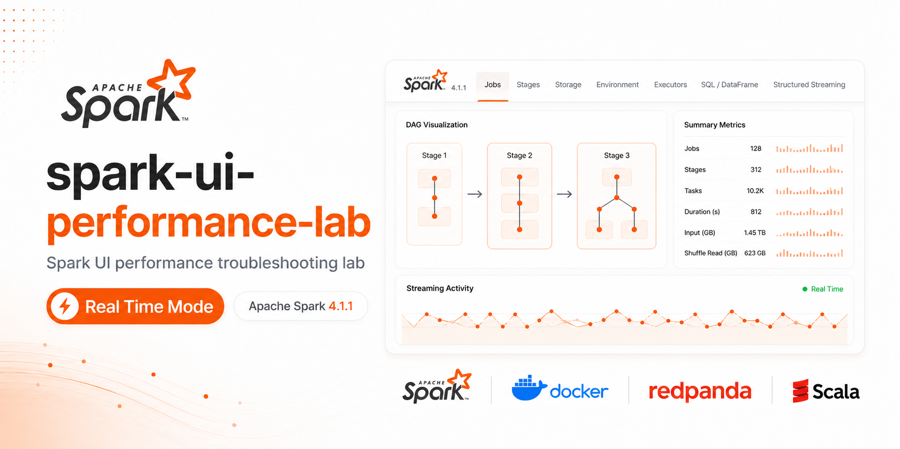

# spark-ui-performance-lab


Public, reproducible Apache Spark performance troubleshooting lab for Data Engineers.

This project teaches how to diagnose common Spark performance problems by reading Spark Web UI evidence. The learning loop is always:

1. Create a realistic performance problem.
2. Run the baseline version.
3. Inspect Spark Web UI evidence.
4. Diagnose the issue.
5. Run the optimized version.
6. Inspect Spark Web UI again.
7. Compare baseline vs optimized behavior.

This is not a generic Spark tutorial, a Kafka tutorial, a notebook project or an AI application.

## What You Learn

- How to use Spark UI Jobs, Stages, SQL, Storage, Executors and Environment tabs.
- How to identify repeated actions, recomputation, shuffle-heavy plans, missing broadcast joins, skew, small files, partition problems, spill, cache misuse, UDF cost, AQE impact and task retries.
- How to inspect Spark History Server after applications finish.
- How to reason over Structured Streaming UI evidence for optional streaming cases.

## Stack

- Apache Spark `4.1.1`.
- Scala `2.13.17`.
- Java base image `eclipse-temurin:17.0.13_11-jdk-jammy`.
- SBT `1.10.7`, installed inside the Spark client container.
- Docker Compose.
- Spark Standalone cluster.
- Spark History Server with event logs enabled.
- Optional Redpanda `docker.redpanda.com/redpandadata/redpanda:v26.1.5` under the `streaming` profile only.

Versions are pinned in `.env.example`. The Spark image is built from the pinned Java base image and downloads the official Apache Spark distribution directly, so no local Scala or SBT installation is required and Spark is not silently downgraded.

## Architecture

Default services:

- `spark-master`
- `spark-worker-1`
- `spark-worker-2`
- `spark-history-server`
- `spark-client`

Optional streaming profile:

- all default services
- `redpanda`

Redpanda is intentionally optional. Batch cases [01](docs/cases/01_too_many_actions.md) to [14](docs/cases/14_config_validation.md) run without streaming infrastructure.

## Ports

- Spark Master UI: <http://localhost:8080>
- Worker 1 UI: <http://localhost:8081>
- Worker 2 UI: <http://localhost:8082>
- Live Spark Application UI: <http://localhost:4040> while a case is running
- Spark History Server: <http://localhost:18080>
- Redpanda Kafka API: `localhost:9092` only with the `streaming` profile

## Quick Start

```bash
cp .env.example .env
./scripts/up.sh
./scripts/build.sh
./scripts/generate-data.sh
./scripts/run-case.sh 01_too_many_actions baseline
./scripts/run-case.sh 01_too_many_actions optimized
```

Makefile shortcuts call the same scripts:

```bash
make up
make build
make generate-data
make run CASE=01_too_many_actions MODE=baseline
make run CASE=01_too_many_actions MODE=optimized
```

Open the live Spark UI while a case is paused at <http://localhost:4040>. After it exits, use Spark History Server at <http://localhost:18080>.

## Optional Prebuilt Docker Image

The default path builds the Spark lab image locally. The project also supports using a prebuilt image from Docker Hub after it has been published:

```bash
docker pull jrvm/spark-ui-performance-lab-spark:4.1.1
cp .env.example .env
```

Set these values in `.env`:

```bash
SPARK_IMAGE=jrvm/spark-ui-performance-lab-spark:4.1.1
SPARK_USE_PREBUILT_IMAGE=true
```

Then start the lab normally:

```bash
./scripts/up.sh
```

For streaming:

```bash
./scripts/up-streaming.sh
```

The repository is still required because it provides the scripts, source code, docs and mounted workspace.

For the complete list of Docker, Spark and runtime flags, see [Spark configuration guide](docs/08-spark-configuration.md#8-runtime-flags-and-switches).

Maintainers can publish the image with:

```bash
docker login
./scripts/publish-dockerhub.sh
```

## Streaming Case Example

```bash
./scripts/up-streaming.sh
./scripts/create-topics.sh
./scripts/produce-streaming-data.sh
./scripts/inspect-streaming.sh topics
./scripts/run-case.sh 15_structured_streaming_backlog baseline
./scripts/run-case.sh 15_structured_streaming_backlog optimized
```

Streaming cases are [15](docs/cases/15_structured_streaming_backlog.md), [16](docs/cases/16_stateful_streaming.md) and [17](docs/cases/17_real_time_mode.md). Case [17_real_time_mode](docs/cases/17_real_time_mode.md) supports `baseline` and `advanced` modes; `optimized` is accepted as an alias for the advanced mode.

For the Redpanda topic flow and Spark 4.1 real-time mode, see [Streaming and real-time mode](docs/09-streaming-real-time-mode.md).
For timed vs interactive streaming runs, see [runtime flags](docs/08-spark-configuration.md#8-runtime-flags-and-switches).

## Stop And Clean

```bash
./scripts/down.sh
./scripts/clean.sh
```

`clean.sh` removes generated data, metrics, tmp files, checkpoints and warehouse data. It does not delete source files.

To stop only Redpanda while keeping the Spark services running:

```bash
docker compose --profile streaming stop redpanda
```

## What This Lab Does Not Do

- No notebooks as the main execution path.
- No DStreams. DStreams are legacy and intentionally omitted.
- No cloud dependencies.
- No Databricks-specific dependencies.
- No external datasets.
- No fake benchmark claims or fixed latency promises.
- No mandatory Redpanda for batch cases.
- Screenshots are used selectively for UI orientation. Learners should still reproduce and inspect their own Spark UI evidence.

## AI Scope

AI is included only as optional documentation for LLM-assisted reasoning over Spark UI evidence.

The runtime does not call LLM APIs, require API keys, use embeddings, RAG, vector databases, agents or automatic screenshot analysis. This keeps the proof of concept focused, deterministic, reproducible and vendor-neutral.

The goal is to learn Spark UI diagnosis first. The prompt templates help learners structure observations after they manually inspect Spark UI evidence; AI is not a replacement for understanding Spark internals.

## Documentation

- [Quickstart](docs/00-quickstart.md)
- [Runbook](docs/01-runbook.md)
- [Spark UI map](docs/02-spark-ui-map.md)
- [Case catalog](docs/03-case-catalog.md)
- [Troubleshooting](docs/04-troubleshooting.md)
- [Code execution map](docs/05-code-execution-map.md)
- [Lab flow tree](docs/06-lab-flow-tree.md)
- [Screenshot capture guide](docs/07-screenshot-capture-guide.md)
- [Spark configuration guide](docs/08-spark-configuration.md)
- [Streaming and real-time mode](docs/09-streaming-real-time-mode.md)
- [Why AI is documentation-only](docs/ai/00-why-ai-is-documentation-only.md)
