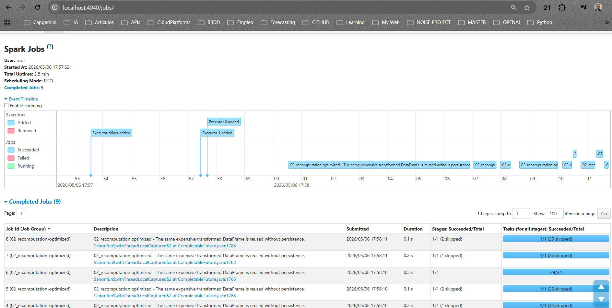
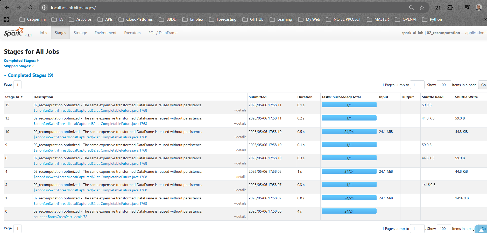
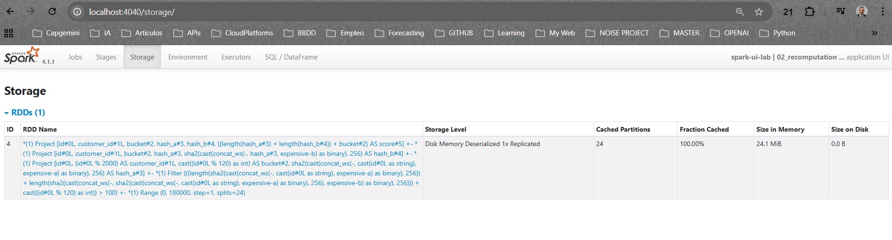
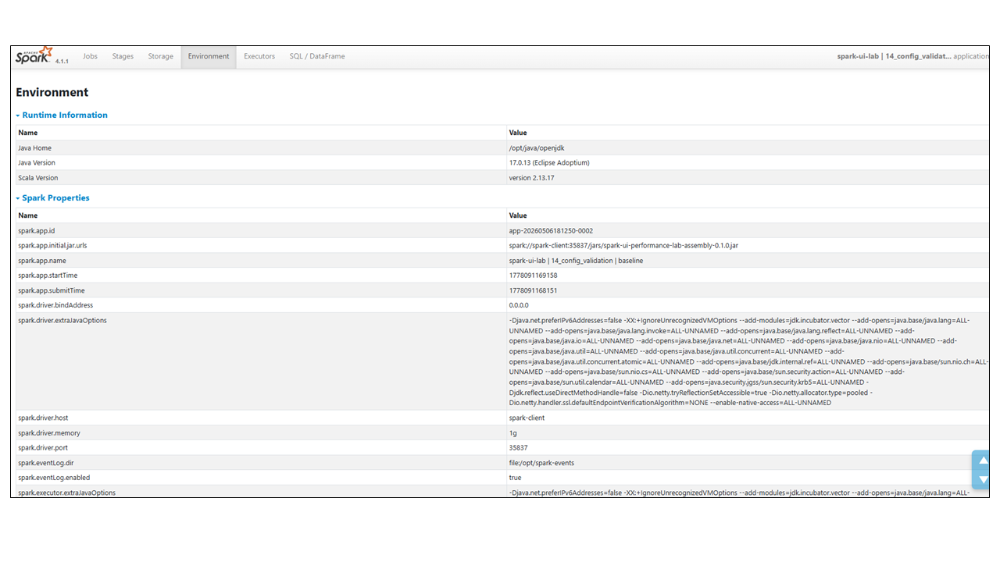
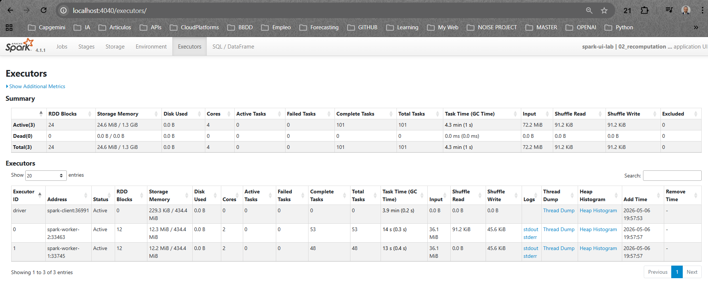
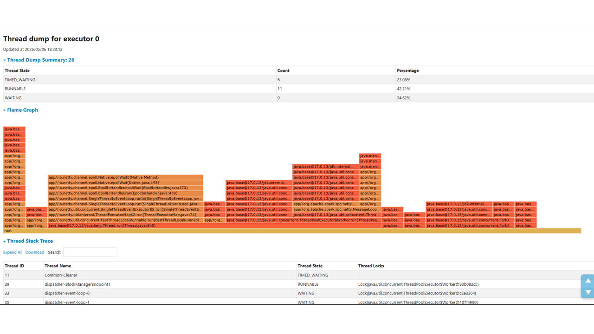
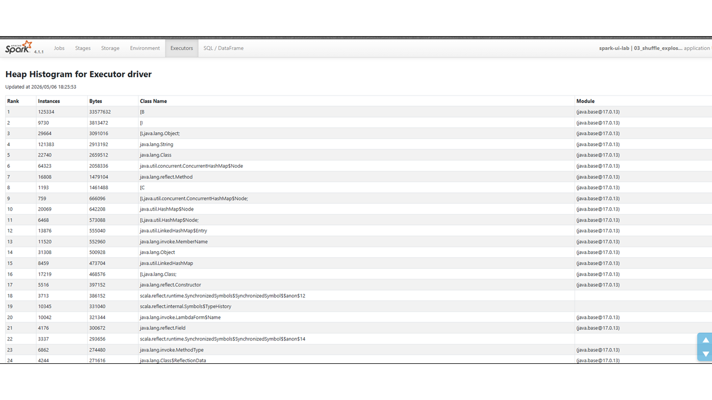
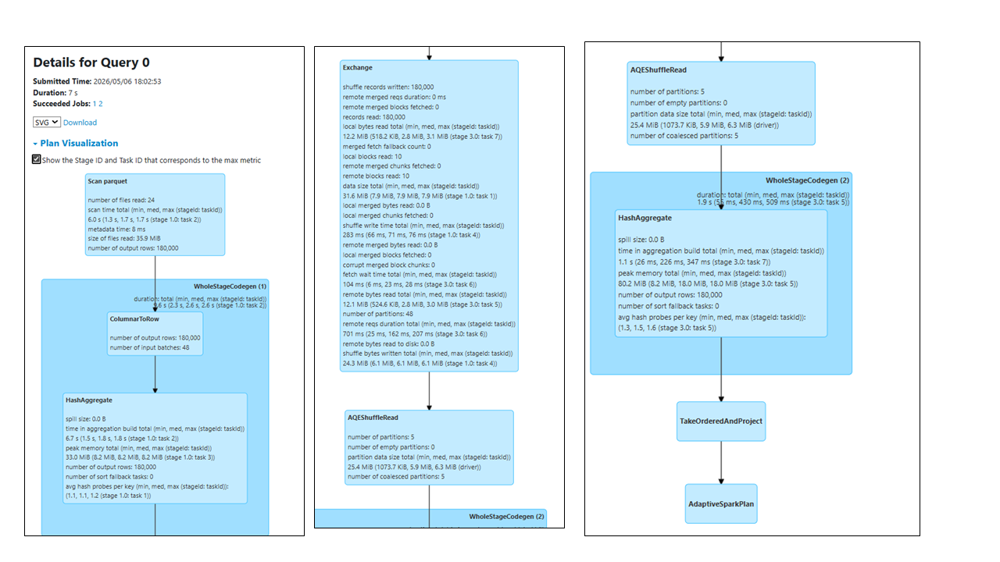
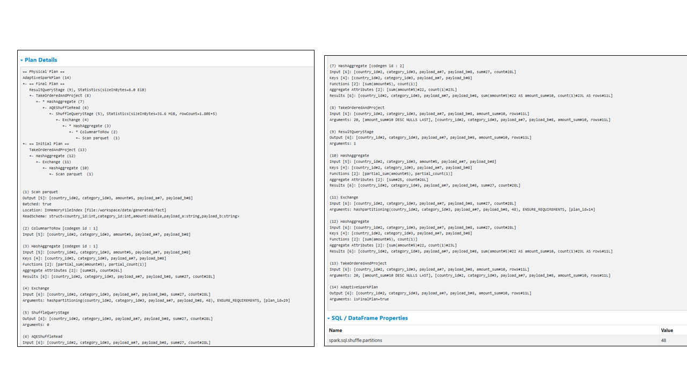

# Spark UI Map

Use this page as the UI vocabulary for the lab. Each case tells you which tabs and drilldowns matter. Do not inspect every metric in every case; Spark UI is useful when you read it with a question in mind.

Spark UI has built-in help in many tables. Hover over column titles such as task time, scheduler delay, shuffle read, spill, storage memory or locality to see a short explanation from Spark itself. Use those hover cards as first-line help while this guide explains how each metric fits the lab cases.

## Jobs

Shows Spark jobs created by actions. Use it to diagnose repeated actions, failed jobs, retry patterns and jobs that finish too quickly to inspect elsewhere.

Cases: [01](cases/01_too_many_actions.md), [02](cases/02_recomputation.md), [06](cases/06_small_files.md), [08](cases/08_too_many_partitions.md), [13](cases/13_task_failure_retry.md).

What to read:

- `Completed Jobs`: how many Spark jobs the application created.
- `Job Group`: confirms you are looking at the selected case and mode.
- `Associated SQL Query`: links a DataFrame action to the SQL/DataFrame tab.
- `Completed Stages` and `Skipped Stages`: shows whether this job executed new stages or reused already completed stage output.
- `Event Timeline`: useful for seeing bursts of many small jobs or retries over time.

Common interpretation:

- One Spark application can create many jobs. A job is usually triggered by an action such as `count`, `collect`, `write` or `foreachBatch`.
- Skipped stages are not failed stages. They usually mean Spark found already completed stage output it could reuse inside the same application.
- `Scheduling Mode: FIFO` means jobs are scheduled in submission order. This is the default in this lab. It can be changed with Spark scheduling pools, but this lab does not tune it because the cases focus on query and data behavior.

## Stages

Shows stage DAGs, task counts, task duration distribution, shuffle read/write, spill and failed task attempts. Use it for skew, partitioning, shuffle explosion, spill and retries.

Cases: [01](cases/01_too_many_actions.md), [02](cases/02_recomputation.md), [03](cases/03_shuffle_explosion.md), [05](cases/05_data_skew.md), [06](cases/06_small_files.md), [07](cases/07_too_few_partitions.md), [08](cases/08_too_many_partitions.md), [09](cases/09_spill.md), [12](cases/12_aqe_comparison.md), [13](cases/13_task_failure_retry.md).

What to read:

- `Tasks: Succeeded/Total`: tells you the amount of parallel work.
- `Duration`: stage wall-clock duration.
- `Shuffle Read` and `Shuffle Write`: evidence of data movement between stages.
- Stage detail page: task-level percentiles, locality, spill, GC, scheduler delay and failed attempts.
- `DAG Visualization`: shows stage dependencies. Use it when the problem is about repeated lineage, shuffle boundaries, joins or retries.

Stage detail metrics:

- `Scheduler Delay`: time waiting before task execution. High values can point to scheduling pressure or too many tiny tasks.
- `Task Deserialization Time`: time to deserialize task code and metadata on the executor.
- `Shuffle Read Fetch Wait Time`: time waiting for remote shuffle blocks.
- `Shuffle Remote Reads`: evidence that shuffle data came from other executors.
- `Result Serialization Time` and `Getting Result Time`: driver/result transfer overhead.
- `Peak Execution Memory`: memory used by execution operators such as sort, aggregate or join.
- `Memory Spill` and `Disk Spill`: data moved out of memory during execution. These are central in [case 09](cases/09_spill.md).
- `Locality Level`: where the task ran relative to its data. `NODE_LOCAL` means the task ran on the same worker node as the data; in this Docker lab it is usually not the main bottleneck.

## Storage

Shows cached or persisted DataFrames/RDDs. Use it to verify whether persistence helps or whether memory is wasted.

Cases: [02](cases/02_recomputation.md), [10](cases/10_cache_misuse.md).

## Environment

Shows actual Spark properties, JVM information and classpath evidence. Use it to verify what config Spark actually received.

Cases: [14](cases/14_config_validation.md).

What to read:

- `Runtime Information`: Java and Scala versions used by the application.
- `Spark Properties`: the final values Spark received after defaults, submit arguments and case-level overrides.
- `spark.app.name`: confirms case id and mode.
- `spark.master`, `spark.executor.memory`, `spark.sql.shuffle.partitions`, `spark.sql.adaptive.enabled`: common lab values to verify.

Use this tab when the question is "what configuration actually ran?". Do not infer active configuration only from a script or from memory.

## Executors

Shows executor memory, task totals, failed tasks, shuffle, storage and GC-related evidence. Use it to detect underuse, spill pressure and task retry impact.

Cases: [07](cases/07_too_few_partitions.md), [09](cases/09_spill.md), [10](cases/10_cache_misuse.md), [13](cases/13_task_failure_retry.md).

What to read:

- `Cores`: available parallelism per executor.
- `Active Tasks`: currently running tasks while the app is live.
- `Complete Tasks` and `Total Tasks`: whether work was distributed across executors.
- `Failed Tasks`: retry/failure evidence.
- `Task Time (GC Time)`: total executor task time and the portion spent in garbage collection.
- `Storage Memory`: cached/persisted data footprint. Use this with the Storage tab.
- `Shuffle Read` and `Shuffle Write`: executor-level data movement.
- `Logs`: useful when a task fails and you need stdout/stderr.
- `Thread Dump`: point-in-time JVM stack traces for driver or executor threads.
- `Heap Histogram`: JVM object histogram showing object classes and approximate memory footprint.

How to interpret values:

- Exact task time, GC time, storage memory and shuffle bytes are not portable benchmark numbers.
- Distribution is more important than the exact value. For example, [case 07](cases/07_too_few_partitions.md) should show underuse with too few tasks; [case 10](cases/10_cache_misuse.md) should show storage memory when unnecessary cache is used; [case 13](cases/13_task_failure_retry.md) should show failed task evidence.
- A small non-zero `Storage Memory` value can appear even when the primary Storage tab has no meaningful cached dataset. Use the Storage tab as the source of truth for persisted DataFrames.

Executor drilldowns:

- Use `Thread Dump` only when the app appears stuck, blocked or spending unexpected time outside normal task execution. It is advanced JVM evidence, not required for the main lab flow.
- Use `Heap Histogram` only when investigating memory pressure beyond the normal Storage, Stages and Executors metrics. It can show large object families, but it is not a Spark SQL diagnosis by itself.
- Use `stdout` and `stderr` logs when a task or executor fails. The lab configures workers with `SPARK_PUBLIC_DNS=localhost` so new executor log links should open from the host browser.
- If an old application still shows internal names such as `spark-worker-1:8081`, replace them with `localhost:8081` or `localhost:8082`, or recreate the services and rerun the case.

Thread Dump:

- A thread dump is a point-in-time snapshot of JVM thread stacks.
- `RUNNABLE` means a thread is executing or ready to execute on CPU.
- `WAITING` and `TIMED_WAITING` usually mean a thread is parked, sleeping or waiting for coordination.
- `BLOCKED`, if present, means a thread is waiting to enter a synchronized section.
- Use it after Executors or Stages suggest a stuck driver/executor, not as the first diagnostic tab.

Heap Histogram:

- A heap histogram groups live JVM objects by class at the time of capture.
- `Instances` is the number of objects of that class.
- `Bytes` is the approximate memory footprint for that class.
- Class names such as `[B`, `[I` and `[Ljava.lang.Object;` are JVM array types: byte array, int array and object array.
- Large Spark/JVM internals are normal. Treat this as advanced memory evidence, not as proof of a Spark SQL problem by itself.

When this lab uses Executors:

| Case | Why Executors matters |
|---|---|
| [07_too_few_partitions](cases/07_too_few_partitions.md) | Confirm that available cores/workers are underused because there are too few tasks. |
| [09_spill](cases/09_spill.md) | Support spill or memory-pressure diagnosis with GC, task time and executor memory evidence. |
| [10_cache_misuse](cases/10_cache_misuse.md) | Support Storage evidence by showing storage memory used by cached data. |
| [13_task_failure_retry](cases/13_task_failure_retry.md) | Confirm failed task counts and use logs if the controlled failure needs inspection. |

Thread Dump and Heap Histogram are intentionally not required for any default case. They are included as advanced exploration tools after the learner understands the normal Spark UI evidence.

## SQL

Shows SQL/DataFrame query plans and execution metrics. Use it to inspect Exchange, SortMergeJoin, BroadcastHashJoin, AdaptiveSparkPlan, UDF expressions and physical plan shape.

Cases: [03](cases/03_shuffle_explosion.md), [04](cases/04_broadcast_join.md), [05](cases/05_data_skew.md), [11](cases/11_udf_cost.md), [12](cases/12_aqe_comparison.md).

DataFrame API still appears here. You do not need to write SQL for Spark to create SQL/DataFrame executions.

What to read:

- Query list: one or more SQL/DataFrame executions created by actions.
- `Associated Jobs`: which jobs belong to the query.
- `Plan Visualization`: graphical operator tree with runtime metrics.
- `Plan Details`: physical plan text. Use it to search for operators.

Useful operators:

- `Range`: synthetic source used by many lab cases.
- `Filter`: rows removed before later work.
- `Project`: selected or computed columns.
- `HashAggregate`: aggregation operator.
- `Exchange`: shuffle boundary. This is a key signal in shuffle and join cases.
- `AQEShuffleRead`: Adaptive Query Execution reading an adapted shuffle.
- `AdaptiveSparkPlan`: AQE is active for the query.
- `SortMergeJoin`: shuffle join; important in [case 04](cases/04_broadcast_join.md).
- `BroadcastHashJoin` and `BroadcastExchange`: broadcast join evidence; important in [case 04](cases/04_broadcast_join.md).
- UDF-related expressions: important in [case 11](cases/11_udf_cost.md).

When to use SQL:

- Optional in [01](cases/01_too_many_actions.md) and [02](cases/02_recomputation.md): open one query to connect DataFrame actions to SQL plans, but do not over-analyze every operator.
- Required in [03](cases/03_shuffle_explosion.md), [04](cases/04_broadcast_join.md), [05](cases/05_data_skew.md), [11](cases/11_udf_cost.md) and [12](cases/12_aqe_comparison.md): the physical plan is part of the diagnosis.
- Helpful in [09](cases/09_spill.md): use it if you want to connect spill or memory pressure to sort/aggregate operators.

Plan Details:

Read Plan Visualization first for shape, then Plan Details for exact operator names and config values. In this lab, text search for `Exchange`, `SortMergeJoin`, `BroadcastHashJoin`, `BroadcastExchange`, `AdaptiveSparkPlan`, `AQEShuffleRead` or UDF-related expressions is usually enough.

## Structured Streaming

Shows streaming query progress, input rows/sec, processed rows/sec, batch duration, state operator metrics and query status.

Cases: [15](cases/15_structured_streaming_backlog.md), [16](cases/16_stateful_streaming.md), [17](cases/17_real_time_mode.md).

## History Server

Reads persisted Spark event logs after applications exit. Use it whenever the live UI was missed or when comparing baseline and optimized runs after both complete.

All cases write event logs to the shared `spark-events` Docker volume.

## REST API Metrics

`./scripts/export-metrics.sh <case_id> <mode>` exports the History Server applications REST index to `metrics/`. This is intentionally minimal; use the exported app id for deeper manual REST calls if needed.

## Reproducibility Of Metrics

This lab is designed to reproduce the same diagnosis flow, not the same exact numbers.

Stable across machines:

- Case and mode names.
- Required UI tabs.
- Presence or absence of important operators.
- Relative patterns such as fewer jobs, fewer tasks, visible cache, broadcast join, failed retry, state metrics or AQE evidence.

Variable across machines:

- Duration.
- Task time.
- GC time.
- Scheduler delay.
- Shuffle byte counts.
- Spill byte counts.
- Peak memory.
- Streaming rows/sec.

Use exact numbers only as local evidence for your own run. In public documentation or screenshots, describe patterns such as "more jobs than optimized", "Storage tab contains the persisted DataFrame" or "baseline has many more tiny tasks" instead of claiming universal timings.

## Drilldown Rules

Use this rule of thumb while running the lab:

| Evidence needed | Open this |
|---|---|
| Too many actions or retries | Jobs tab, Event Timeline and one Job detail page |
| Repeated lineage or skipped stages | Jobs, Stages and optional DAG Visualization |
| Shuffle, join or AQE behavior | SQL query, Plan Visualization, Plan Details and Stages |
| Skew or partition count | Stages, stage detail task table and percentile metrics |
| Cache or persist behavior | Storage tab and Executors storage memory |
| Memory pressure or spill | Stage detail metrics and Executors |
| Configuration truth | Environment tab |
| Streaming rate or state | Structured Streaming query progress and state operator metrics |

## Excluded Tabs

The Streaming/DStreams tab is intentionally excluded because DStreams are legacy and the lab uses Structured Streaming only.

The JDBC/ODBC Server tab is not part of the initial lab. It can be added later only if a Spark Thrift Server extension is introduced.
