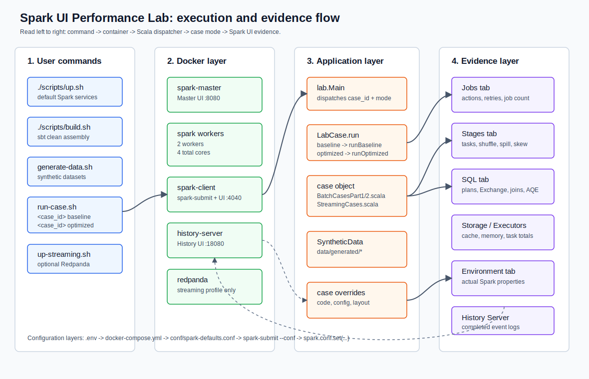

# Code Execution Map

This page maps each lab command to the scripts and Scala source files that are executed. Use it when you want to read the code first, run the case and then inspect the Spark UI evidence.

## Common Execution Path

Every case follows the same high-level path:

```text
user command
  -> scripts/run-case.sh <case_id> <mode>
    -> docker compose exec spark-client spark-submit
      -> --class lab.Main
      -> target/scala-2.13/spark-ui-performance-lab-assembly-0.1.0.jar
      -> lab.Main dispatches to the selected LabCase object
        -> Spark job group is set
        -> baseline or optimized code runs
        -> application pauses for live Spark UI inspection
        -> Spark event log is written for History Server
```

## How Baseline And Optimized Modes Are Selected

The mode is selected by plain application code, not by Spark itself.

When you run:

```bash
./scripts/run-case.sh 01_too_many_actions baseline
```

the script submits:

```text
lab.Main 01_too_many_actions baseline
```

Then `src/main/scala/lab/Main.scala` finds the case object by `case_id` and calls:

```scala
labCase.run(spark, mode)
```

The common interface in `src/main/scala/lab/cases/LabCase.scala` routes the mode:

```scala
mode match {
  case "baseline" => runBaseline(spark)
  case "optimized" => runOptimized(spark)
}
```

So the baseline and the fix live side by side in the Scala object for the case.

Example for `01_too_many_actions`:

```text
src/main/scala/lab/cases/BatchCasesPart1.scala
  -> object TooManyActions
    -> runBaseline   creates repeated actions
    -> runOptimized  consolidates work into one summary action
```

This pattern is used across the lab: the baseline creates the Spark UI symptom, and the optimized mode changes code, data layout, Spark configuration or streaming query design to produce different UI evidence.

Data generation follows this path:

```text
./scripts/generate-data.sh
  -> spark-submit --class lab.Main ... generate_data once
    -> lab.Main
      -> lab.data.SyntheticData.writeAll
        -> writes deterministic datasets under data/generated/
```

Configuration follows this path:

```text
.env / .env.example
  -> docker-compose.yml
    -> conf/spark-defaults.conf
      -> scripts/run-case.sh spark-submit --conf values
        -> case-specific spark.conf.set(...) values
          -> Spark UI Environment tab
```

For the full explanation, see `docs/08-spark-configuration.md`.

## Core Files

| File | Role |
|---|---|
| `scripts/run-case.sh` | Source-of-truth runner for one case and mode. |
| `scripts/generate-data.sh` | Generates deterministic local datasets. |
| `scripts/run-all.sh` | Runs batch cases `01` to `14` only. |
| `scripts/up.sh` | Starts Spark default services without Redpanda. |
| `scripts/up-streaming.sh` | Starts Spark plus Redpanda with Docker Compose profile `streaming`. |
| `src/main/scala/lab/Main.scala` | CLI dispatcher: `<case_id> <mode>`. |
| `src/main/scala/lab/cases/LabCase.scala` | Minimal common case interface. |
| `src/main/scala/lab/utils/LabSupport.scala` | UI messages, job groups, paths and streaming query stop logic. |
| `src/main/scala/lab/data/SyntheticData.scala` | Synthetic batch data generation and fallback in-memory data. |

## Batch Cases

| Case | Command | Scala object | Source file | Data touched | Main UI tabs |
|---|---|---|---|---|---|
| `01_too_many_actions` | `./scripts/run-case.sh 01_too_many_actions baseline|optimized` | `TooManyActions` | `src/main/scala/lab/cases/BatchCasesPart1.scala` | In-memory synthetic fact frame | Jobs, Stages |
| `02_recomputation` | `./scripts/run-case.sh 02_recomputation baseline|optimized` | `Recomputation` | `src/main/scala/lab/cases/BatchCasesPart1.scala` | In-memory expensive frame | Jobs, Stages, Storage |
| `03_shuffle_explosion` | `./scripts/run-case.sh 03_shuffle_explosion baseline|optimized` | `ShuffleExplosion` | `src/main/scala/lab/cases/BatchCasesPart1.scala` | `data/generated/fact` | SQL, Stages |
| `04_broadcast_join` | `./scripts/run-case.sh 04_broadcast_join baseline|optimized` | `BroadcastJoinCase` | `src/main/scala/lab/cases/BatchCasesPart1.scala` | `fact`, `dim_customers` | SQL, Stages |
| `05_data_skew` | `./scripts/run-case.sh 05_data_skew baseline|optimized` | `DataSkewCase` | `src/main/scala/lab/cases/BatchCasesPart1.scala` | `skew_events` plus generated right side | Stages, SQL |
| `06_small_files` | `./scripts/run-case.sh 06_small_files baseline|optimized` | `SmallFilesCase` | `src/main/scala/lab/cases/BatchCasesPart1.scala` | `small_files`, `tmp/case06_compacted_small_files` | Jobs, Stages |
| `07_too_few_partitions` | `./scripts/run-case.sh 07_too_few_partitions baseline|optimized` | `TooFewPartitionsCase` | `src/main/scala/lab/cases/BatchCasesPart1.scala` | In-memory range | Executors, Stages |
| `08_too_many_partitions` | `./scripts/run-case.sh 08_too_many_partitions baseline|optimized` | `TooManyPartitionsCase` | `src/main/scala/lab/cases/BatchCasesPart2.scala` | In-memory range | Jobs, Stages |
| `09_spill` | `./scripts/run-case.sh 09_spill baseline|optimized` | `SpillCase` | `src/main/scala/lab/cases/BatchCasesPart2.scala` | In-memory wide/narrow frames | Stages, Executors |
| `10_cache_misuse` | `./scripts/run-case.sh 10_cache_misuse baseline|optimized` | `CacheMisuseCase` | `src/main/scala/lab/cases/BatchCasesPart2.scala` | In-memory fact frame | Storage, Executors |
| `11_udf_cost` | `./scripts/run-case.sh 11_udf_cost baseline|optimized` | `UdfCostCase` | `src/main/scala/lab/cases/BatchCasesPart2.scala` | In-memory range | SQL |
| `12_aqe_comparison` | `./scripts/run-case.sh 12_aqe_comparison baseline|optimized` | `AqeComparisonCase` | `src/main/scala/lab/cases/BatchCasesPart2.scala` | `fact`, `dim_customers` | SQL, Stages |
| `13_task_failure_retry` | `./scripts/run-case.sh 13_task_failure_retry baseline|optimized` | `TaskFailureRetryCase` | `src/main/scala/lab/cases/BatchCasesPart2.scala` | In-memory range plus `/opt/spark-checkpoints/case13_fail_once.marker` | Jobs, Stages, Executors |
| `14_config_validation` | `./scripts/run-case.sh 14_config_validation baseline|optimized` | `ConfigValidationCase` | `src/main/scala/lab/cases/BatchCasesPart2.scala` | In-memory range | Environment |

## Streaming Cases

Streaming cases require Redpanda:

```bash
./scripts/up-streaming.sh
./scripts/create-topics.sh
./scripts/produce-streaming-data.sh
```

| Case | Command | Scala object | Source file | Topics/checkpoints | Main UI tabs |
|---|---|---|---|---|---|
| `15_structured_streaming_backlog` | `./scripts/run-case.sh 15_structured_streaming_backlog baseline|optimized` | `StructuredStreamingBacklogCase` | `src/main/scala/lab/cases/StreamingCases.scala` | `spark-ui-lab-input`, `case15_*` checkpoints | Structured Streaming |
| `16_stateful_streaming` | `./scripts/run-case.sh 16_stateful_streaming baseline|optimized` | `StatefulStreamingCase` | `src/main/scala/lab/cases/StreamingCases.scala` | `spark-ui-lab-stateful-input`, `case16_*` checkpoints | Structured Streaming |
| `17_real_time_mode` | `./scripts/run-case.sh 17_real_time_mode baseline|advanced` | `RealTimeModeCase` | `src/main/scala/lab/cases/StreamingCases.scala` | `spark-ui-lab-input`, `spark-ui-lab-output`, `case17_*` checkpoints | Structured Streaming |

## What To Read Before Running A Case

1. Open this file and find the case row.
2. Open the listed Scala source file.
3. Read the `runBaseline` method first.
4. Run the baseline command.
5. Inspect the listed Spark UI tabs.
6. Read `runOptimized`.
7. Run the optimized command.
8. Compare the same tabs again.

## Fix Implementation Map

Use this table to connect the UI symptom with the code-level change applied by `runOptimized`.

| Case | Baseline creates | Optimized changes |
|---|---|---|
| `01_too_many_actions` | Runs several independent actions over the same filtered/transformed DataFrame: `count`, filtered `count`, grouped `count`, aggregate `collect`. | Computes the required metrics together in one aggregate action, reducing Spark jobs. |
| `02_recomputation` | Reuses an expensive transformed DataFrame without persistence. | Adds `persist(MEMORY_AND_DISK)`, materializes once and unpersists after inspection. |
| `03_shuffle_explosion` | Groups by wide payload columns and uses more shuffle partitions. | Filters early, selects fewer columns, groups by fewer keys and lowers local shuffle partitions. |
| `04_broadcast_join` | Disables broadcast and forces a shuffle join shape. | Enables broadcast threshold and uses `broadcast(dim)` for the small side. |
| `05_data_skew` | Joins data with a dominant hot key and disables skew handling. | Salts the hot key, expands the small side for salted keys and enables skew handling. |
| `06_small_files` | Reads many small JSON files directly. | Compacts input into fewer Parquet files before downstream reading. |
| `07_too_few_partitions` | Forces one partition. | Repartitions to a reasonable local parallelism value. |
| `08_too_many_partitions` | Forces hundreds of partitions for small data. | Coalesces/repartitions to fewer tasks. |
| `09_spill` | Uses wide rows and low shuffle partition count. | Narrows rows and increases partitioning for lower memory pressure. |
| `10_cache_misuse` | Caches a wide DataFrame that is not reused enough. | Removes unnecessary cache. |
| `11_udf_cost` | Uses a Scala UDF for simple even/odd labeling. | Replaces UDF with built-in `when/otherwise` SQL expressions. |
| `12_aqe_comparison` | Disables AQE for the query. | Enables AQE for the same query shape. |
| `13_task_failure_retry` | Intentionally fails one partition once. | Validates and filters bad input before processing. |
| `14_config_validation` | Prints active config for inspection. | Passes explicit `spark-submit` config and verifies it in Environment. |
| `15_structured_streaming_backlog` | Uses higher offsets per trigger and an artificial processing delay. | Lowers offsets per trigger and removes artificial delay. |
| `16_stateful_streaming` | Stateful aggregation without a bounded watermark strategy. | Adds watermarking and smaller bounded windows. |
| `17_real_time_mode` | Runs a standard micro-batch stateless query. | Uses Spark 4.1 real-time trigger where supported. |

## Visual Dependency Map


