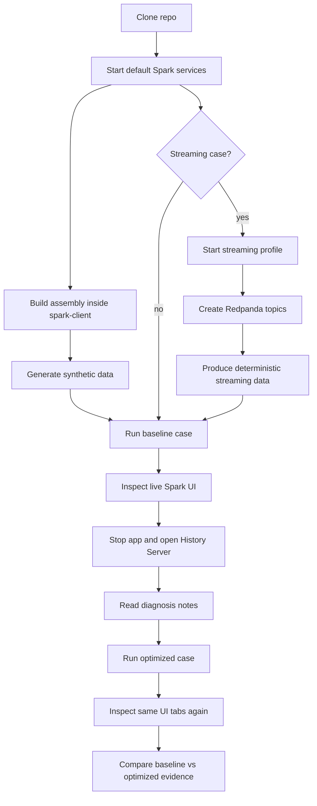

# Lab Flow Tree

This is the full lab flow at a glance.

```text
spark-ui-performance-lab
|
|-- Docker layer
|   |-- docker-compose.yml
|   |   |-- default services
|   |   |   |-- spark-master        -> Spark Master UI :8080
|   |   |   |-- spark-worker-1      -> Worker UI :8081
|   |   |   |-- spark-worker-2      -> Worker UI :8082
|   |   |   |-- spark-history-server -> History UI :18080
|   |   |   `-- spark-client        -> spark-submit + live app UI :4040
|   |   `-- streaming profile
|   |       `-- redpanda            -> Kafka API :9092
|   |
|   `-- docker/spark-client/Dockerfile
|       |-- Java 17 base image
|       |-- official Apache Spark 4.1.1 distribution
|       `-- SBT inside the container
|
|-- Build layer
|   |-- build.sbt
|   |-- project/plugins.sbt
|   `-- scripts/build.sh
|       `-- sbt clean assembly
|
|-- Data layer
|   |-- scripts/generate-data.sh
|   `-- src/main/scala/lab/data/SyntheticData.scala
|       |-- data/generated/fact
|       |-- data/generated/dim_customers
|       |-- data/generated/skew_events
|       `-- data/generated/small_files
|
|-- Execution layer
|   |-- scripts/run-case.sh <case_id> <mode>
|   |-- src/main/scala/lab/Main.scala
|   `-- src/main/scala/lab/cases/
|       |-- LabCase.scala
|       |-- BatchCasesPart1.scala   -> cases 01-07
|       |-- BatchCasesPart2.scala   -> cases 08-14
|       `-- StreamingCases.scala    -> cases 15-17
|
|-- Evidence layer
|   |-- Live Spark UI               -> http://localhost:4040
|   |-- Spark History Server        -> http://localhost:18080
|   |-- Spark event logs            -> spark-events volume
|   `-- metrics/                    -> optional REST API exports
|
`-- Learning layer
    |-- docs/01-runbook.md
    |-- docs/02-spark-ui-map.md
    |-- docs/03-case-catalog.md
    |-- docs/05-code-execution-map.md
    |-- docs/06-lab-flow-tree.md
    `-- docs/ai/
```

## Mermaid Overview



## Default Batch Flow

```bash
./scripts/up.sh
./scripts/build.sh
./scripts/generate-data.sh
./scripts/run-case.sh 01_too_many_actions baseline
./scripts/run-case.sh 01_too_many_actions optimized
```

## Streaming Flow

```bash
./scripts/up-streaming.sh
./scripts/create-topics.sh
./scripts/produce-streaming-data.sh
./scripts/run-case.sh 15_structured_streaming_backlog baseline
./scripts/run-case.sh 15_structured_streaming_backlog optimized
```

## Evidence Flow

```text
running application
  -> live Spark UI at localhost:4040
    -> inspect the tab listed by the case
      -> press Enter in the terminal when finished
        -> Spark writes event log
          -> History Server shows completed app at localhost:18080
            -> compare baseline and optimized executions
```
