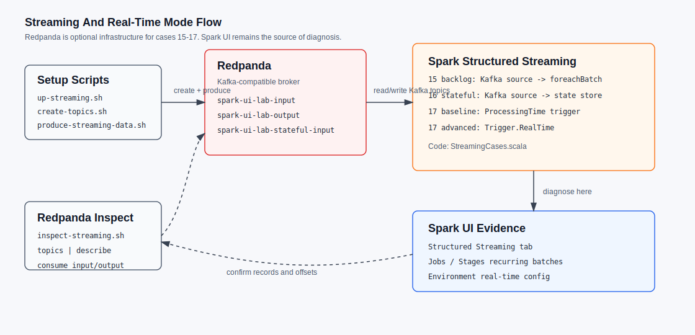
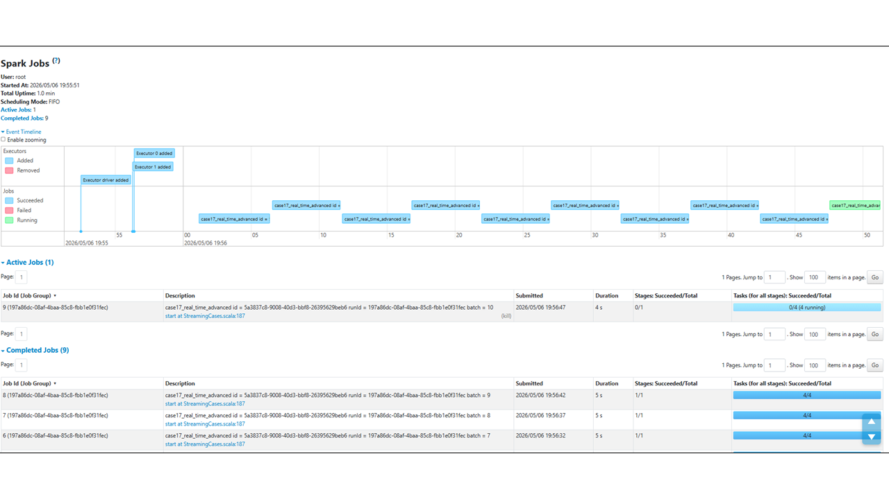
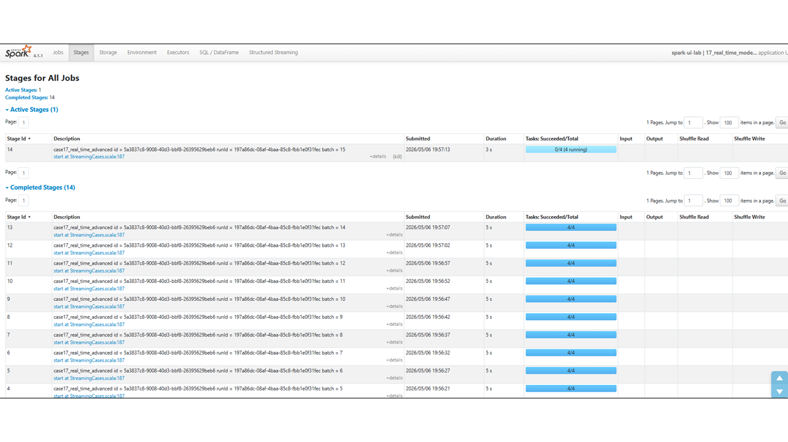
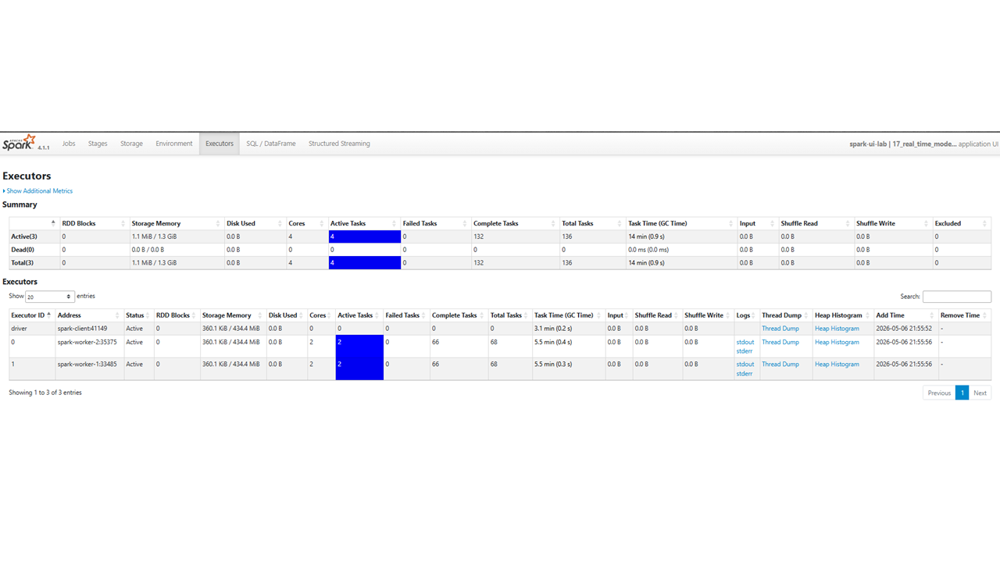
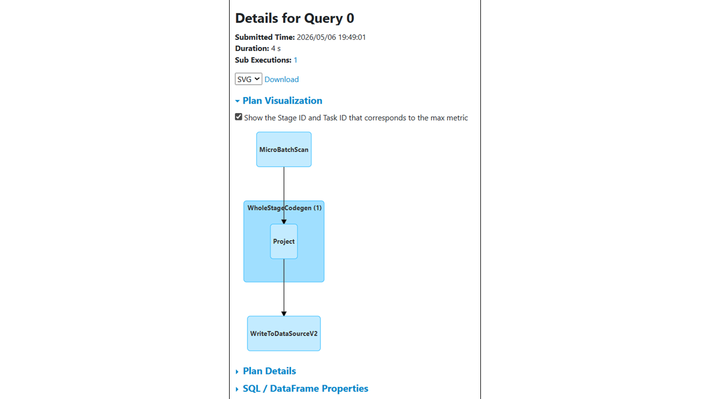

# Streaming And Real-Time Mode

Use this page with [Runbook](01-runbook.md), [Spark UI Map](02-spark-ui-map.md) and [case 17](cases/17_real_time_mode.md).



## What Redpanda Does

Redpanda is the Kafka-compatible broker used only by streaming cases. It is not part of the batch lab.

In this project it provides three topics:

| Topic | Used by | Purpose |
|---|---|---|
| `spark-ui-lab-input` | Cases `15` and `17` | Deterministic input records. |
| `spark-ui-lab-output` | Case `17` | Kafka sink output for the stateless query. |
| `spark-ui-lab-stateful-input` | Case `16` | Deterministic input for stateful aggregation. |

Spark reads offsets from Redpanda, processes them with Structured Streaming and stores progress in checkpoints under `/opt/spark-checkpoints`.

Do not use Redpanda consumer groups as the main proof that Spark processed data. Spark UI query progress and checkpoints are the source of truth for Spark processing.

## Start And Stop

Start Spark plus Redpanda:

```bash
./scripts/up-streaming.sh
./scripts/create-topics.sh
./scripts/produce-streaming-data.sh
```

Stop all lab services, including Redpanda:

```bash
./scripts/down.sh
```

Stop only Redpanda:

```bash
docker compose --profile streaming stop redpanda
```

If Redpanda is stopped while a streaming query is running, the query should fail because the Kafka source/sink is unavailable.

Streaming cases are interactive by default. They keep running until Enter is pressed in the terminal. For automated or timed validation runs, use the flags documented in [Spark configuration](08-spark-configuration.md#8-runtime-flags-and-switches), for example `LAB_AUTO_EXIT=true LAB_AUTO_EXIT_WAIT_SECONDS=15`.

## Inspect Redpanda

List topics:

```bash
./scripts/inspect-streaming.sh topics
```

Describe one topic:

```bash
./scripts/inspect-streaming.sh describe spark-ui-lab-input
```

Read records produced into the input topic:

```bash
./scripts/inspect-streaming.sh consume spark-ui-lab-input 5
```

Read records written by case `17`:

```bash
./scripts/inspect-streaming.sh consume spark-ui-lab-output 5
```

This confirms what exists in Redpanda. Use Spark UI to confirm what Spark read, processed and wrote.

## Case 17 Code Path

The code lives in [StreamingCases.scala](../src/main/scala/lab/cases/StreamingCases.scala).

Baseline:

- `RealTimeModeCase.runBaseline`
- Reads from `spark-ui-lab-input`.
- Writes to `spark-ui-lab-output`.
- Uses `Trigger.ProcessingTime("5 seconds")`.
- Query name: `case17_micro_batch_baseline`.
- Checkpoint: `/opt/spark-checkpoints/case17_micro_batch_baseline`.

Advanced:

- `RealTimeModeCase.runOptimized`
- Reads from the same input topic.
- Writes to the same output topic.
- Sets `spark.sql.streaming.realTimeMode.minBatchDuration=5s`.
- Uses `Trigger.RealTime("5 seconds")`.
- Query name: `case17_real_time_advanced`.
- Checkpoint: `/opt/spark-checkpoints/case17_real_time_advanced`.

`optimized` is accepted as an alias for `advanced`, but documentation uses `advanced` because this case demonstrates a Spark 4.1 capability rather than a universal fix.

## What To Inspect

Primary Spark UI tab:

- Structured Streaming.

Useful supporting tabs:

- Jobs: recurring batches and active job.
- Stages: one active stage and completed stages with recurring 5 second durations.
- Executors: active tasks distributed across workers.
- Environment: real-time mode configuration.

Some batch-style columns can be empty or low-signal for Kafka-to-Kafka streaming. For example, Stages may show no shuffle because the case is stateless and does not shuffle data. For case `17`, query progress, recurring jobs/stages and active executor tasks are more important than shuffle columns.



Jobs should show recurring work for the running streaming query. In real-time mode, this is useful evidence when the Structured Streaming tab has sparse rate values.



Stages should show repeated batches and active tasks. For this stateless Kafka-to-Kafka case, shuffle columns are not the main signal.



Executors should show active tasks distributed across workers while the query is running.



The SQL/DataFrame plan can show `MicroBatchScan` and `WriteToDataSourceV2`. Use it as supporting evidence, not as the primary streaming diagnosis tab.

## Shutdown Messages

Stopping a live streaming query can cancel the batch currently running. If the terminal prints `TaskKilled`, `MicroBatchWrite ... is aborting` or `Could not find CoarseGrainedScheduler` after `Stopping streaming query`, and the script exits with status `0`, treat it as controlled shutdown noise.

If those messages appear before stopping the query, or the script exits non-zero, use [Troubleshooting](04-troubleshooting.md#streaming-query-prints-cancellation-warnings-on-stop).

## Official References

- [Spark Trigger API](https://spark.apache.org/docs/latest/api/java/org/apache/spark/sql/streaming/Trigger.html)
- [Spark configuration](https://spark.apache.org/docs/latest/configuration.html)
