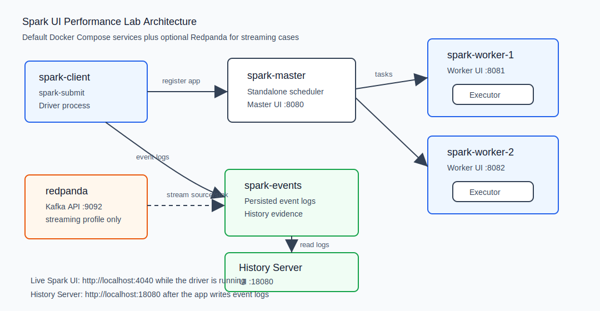

# Spark Architecture Primer

Use this page before or alongside the [Runbook](01-runbook.md) and [Spark UI Map](02-spark-ui-map.md). It gives the minimum Spark architecture vocabulary needed to understand the lab.

This primer is adapted for this repository. The supplemental Spanish reference PDF is stored at [Spark Master Guide Full](assets/Spark_Master_Guide_Full.pdf), but the lab runtime remains Spark Standalone, Scala, Docker Compose and optional Redpanda. Databricks, Delta Lake, Photon and PySpark topics from the broader reference are useful production context, not dependencies of this lab.



## Runtime Components

| Component | What it does | Where to see it in this lab |
|---|---|---|
| Driver | Coordinates execution, builds plans and asks executors to run tasks. | `spark-client`, live UI on <http://localhost:4040>. |
| Cluster Manager | Allocates resources for the application. | `spark-master`, UI on <http://localhost:8080>. |
| Worker | Machine/container that hosts executors. | `spark-worker-1`, `spark-worker-2`. |
| Executor | JVM process that runs tasks and can keep cached data. | Executors tab, Worker UIs. |
| Task | Smallest execution unit. Usually processes one partition. | Stage detail page and task table. |
| Stage | Group of tasks that can run before the next shuffle boundary. | Stages tab. |
| Job | Work triggered by an action such as `count`, `collect`, `write` or streaming batch execution. | Jobs tab. |

## Query Lifecycle

```text
DataFrame code
  -> action
  -> logical plan
  -> optimized logical plan
  -> physical plan
  -> jobs
  -> stages
  -> tasks over partitions
  -> runtime metrics in Spark UI
```

The SQL/DataFrame tab shows the plan side of this lifecycle. Jobs and Stages show the runtime side. Good Spark UI diagnosis connects both views.

## Narrow And Wide Work

Narrow transformations can process each partition without moving data between executors. Examples: `filter`, `select`, simple column expressions.

Wide transformations require data movement. Examples: `groupBy`, `join`, `distinct`, `orderBy`, `repartition`.

In Spark UI, wide transformations usually introduce:

- `Exchange` in the SQL/DataFrame physical plan.
- New stage boundaries.
- Shuffle read/write metrics.

This is why cases [03_shuffle_explosion](cases/03_shuffle_explosion.md), [04_broadcast_join](cases/04_broadcast_join.md), [05_data_skew](cases/05_data_skew.md) and [12_aqe_comparison](cases/12_aqe_comparison.md) use SQL plan evidence heavily.

## Partitions And Parallelism

A task usually processes one partition. This is the core mental model for reading task metrics.

- Too few partitions: too few tasks, idle cores and underused executors.
- Too many partitions: many tiny tasks and scheduling overhead.
- Skewed partitions: one or a few tasks take much longer than the rest.
- Empty partitions: percentiles can be zero or near zero for input/shuffle metrics.

Use [case 07](cases/07_too_few_partitions.md), [case 08](cases/08_too_many_partitions.md) and [case 05](cases/05_data_skew.md) to practice these patterns.

## Shuffle, Joins And Broadcast

Shuffle is expensive because Spark moves data between executors. It appears in joins, aggregations, repartitions and global ordering.

Broadcast joins avoid shuffling the small side of a join by sending it to executors. In Spark UI:

- `SortMergeJoin` plus `Exchange` usually means shuffle join.
- `BroadcastHashJoin` and `BroadcastExchange` mean broadcast join.

Use [case 04_broadcast_join](cases/04_broadcast_join.md) to compare both.

## Memory, Spill And GC

Spark operators such as sort, aggregation and join need execution memory. When data does not fit comfortably, Spark may spill to memory/disk and the JVM may spend more time in garbage collection.

Primary evidence:

- Stage detail metrics: memory spill, disk spill, peak execution memory and GC time.
- Executors tab: `Task Time (GC Time)`, storage memory and failed task counts.

Use [case 09_spill](cases/09_spill.md) for this path. Exact spill/GC values are machine-dependent; the pattern matters more than the number.

## AQE

Adaptive Query Execution changes parts of the physical plan at runtime using observed statistics. It can coalesce shuffle partitions, handle skew and improve join strategy.

In Spark UI, look for:

- `AdaptiveSparkPlan`
- initial vs final plan
- `AQEShuffleRead`

Use [case 12_aqe_comparison](cases/12_aqe_comparison.md).

## Streaming Mental Model

Structured Streaming continuously turns input offsets into incremental Spark execution. For Kafka-compatible sources such as Redpanda:

```text
Redpanda topic
  -> Spark streaming source
  -> query plan
  -> recurring jobs/stages/tasks
  -> checkpoint progress
  -> optional Redpanda output topic
```

Use [Streaming and real-time mode](09-streaming-real-time-mode.md) and [case 17_real_time_mode](cases/17_real_time_mode.md) for the modern Spark 4.1 real-time mode path.
